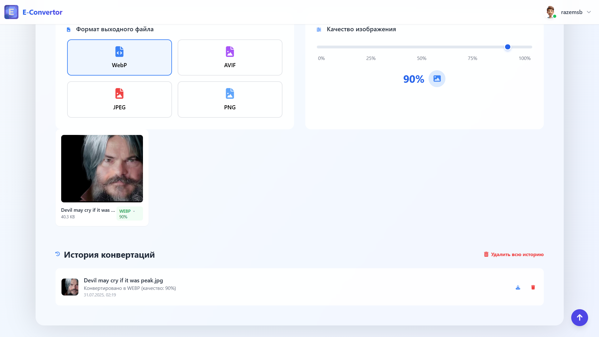
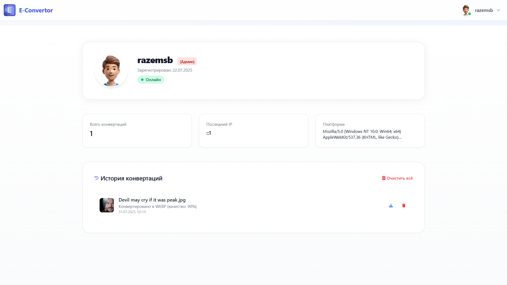

#  Конвертер изображений в WebP/Avif/JPEG/PNG

Профессиональный инструмент для конвертации изображений между популярными форматами с настройкой качества и размера.

## 🌟 Основные возможности

### 🔄 Конвертация форматов
- Поддержка всех современных форматов:
  - **Входные**: JPG, JPEG, PNG
  - **Выходные**: WebP, Avif, JPEG, PNG

### ⚙️ Гибкие настройки
- Регулировка качества сжатия (0-100%)
- Изменение размера с сохранением пропорций
- Выбор формата выходного файла
- Автоматическая оптимизация изображений

### 🖥️ Удобный интерфейс
- Интуитивно понятный дизайн
- Предварительный просмотр результатов
- История конвертаций
- Адаптивный для всех устройств

## 📸 Скриншоты интерфейса

### Главный экран конвертера


### Результат конвертации


### Профиль


### Админ панель (секция Статистики)


### Админ панель (секция Пользователей)


## 🛠️ Технические требования

- **Сервер**: Apache/Nginx
- **PHP**: 8.0+
- **Расширения**:
  - GD
  - Fileinfo
- **Права доступа**: запись в директорию `/converted`

## 🚀 Быстрый старт

1. Клонируйте репозиторий:
```bash
git clone https://github.com/razemsb/ImageConvertor.git
cd ImageConvertor
```

**Настройте права:
chmod -R 755 converted/

Откройте в браузере:

http://localhost/ImageConvertor

🏗️ Структура проекта
```text
image-converter/
├── assets/               # Ресурсы
│   ├── css/              # Стили
│   ├── js/               # Скрипты
│   └── img/              # Изображения
├── config/               # Конфигурация
│   └── DatabaseConnect.php
├── converted/            # Конвертированные файлы
├── admin/                # Админ-панель
├── api/                  # API endpoints
├── index.php             # Точка входа
└── README.md             # Документация
```

## 🔒 Безопасность

- ✅ Валидация MIME-типов файлов  
- ✅ Защита от XSS и SQL-инъекций  
- ✅ CSRF-защита форм  
- ✅ Логирование операций  
- ✅ Ограничение размера загружаемых файлов  

---

## 🏆 Преимущества

- 💾 Сжатие до **80%** — экономия дискового пространства  
- ⚡ Ускоренная загрузка страниц  
- 📁 Поддержка современных форматов изображений  
- 🧠 Простой и понятный интерфейс  
- 🛠️ Полностью open-source  

---

## 🤝 Участие

Хочешь помочь проекту? Вот как начать:

1. Создай [issue](https://github.com/razemsb/ImageConvertor/issues) для обсуждения  
2. Форкни репозиторий  
3. Создай отдельную ветку с изменениями  
4. Отправь Pull Request с кратким описанием, что сделано  

---

## 📜 Лицензия

📝 Лицензия: **AGPL-3.0**  
© 2025 — разработано с ❤️ для сообщества
