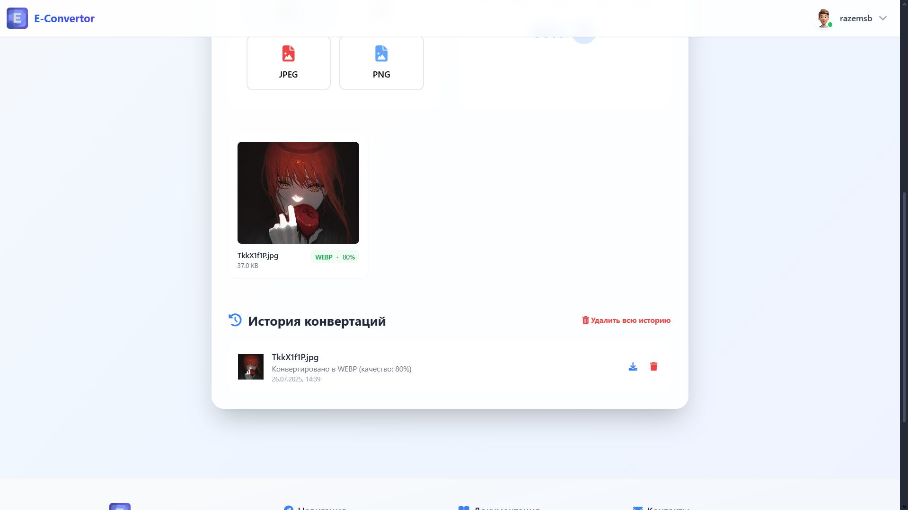
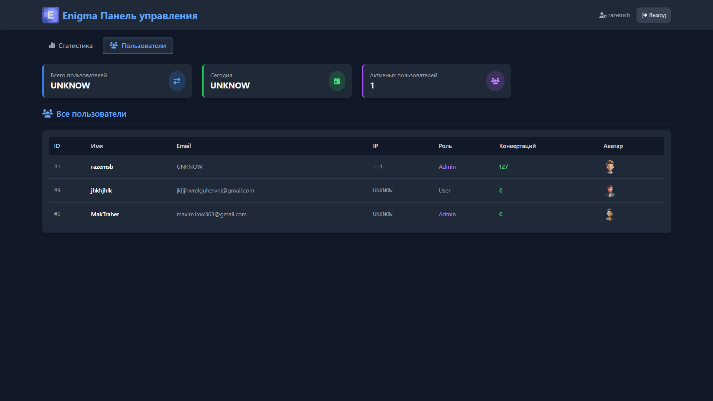
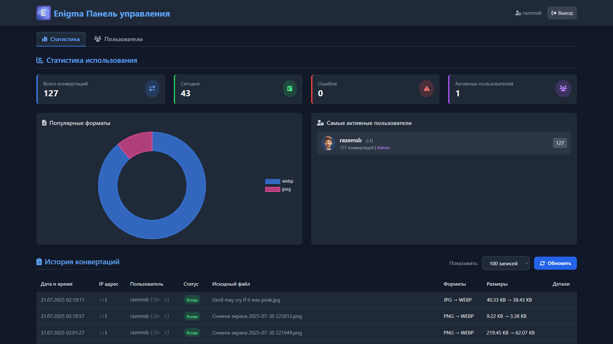

#  Конвертер изображений в WebP/Avif/JPEG/PNG

Профессиональный инструмент для конвертации изображений между популярными форматами с настройкой качества и размера.

## 🌟 Основные возможности

### 🔄 Конвертация форматов
- Поддержка всех современных форматов:
  - **Входные**: JPG, JPEG, PNG
  - **Выходные**: WebP, Avif, JPEG, PNG

### ⚙️ Гибкие настройки
- Регулировка качества сжатия (0-100%)
- Изменение размера с сохранением пропорций
- Выбор формата выходного файла
- Автоматическая оптимизация изображений

### 🖥️ Удобный интерфейс
- Интуитивно понятный дизайн
- Предварительный просмотр результатов
- История конвертаций
- Адаптивный для всех устройств

## 📸 Скриншоты интерфейса

### Главный экран конвертера


### Результат конвертации


### Профиль


### Админ панель


## 🛠️ Технические требования

- **Сервер**: Apache/Nginx
- **PHP**: 8.0+
- **Расширения**:
  - GD
  - Fileinfo
- **Права доступа**: запись в директорию `/converted`

## 🚀 Быстрый старт

1. Клонируйте репозиторий:
```bash
git clone https://github.com/razemsb/ImageConvertor.git
cd ImageConvertor
```

**Настройте права:
chmod -R 755 converted/

Откройте в браузере:

http://localhost/ImageConvertor

🏗️ Структура проекта
```text
image-converter/
├── assets/               # Ресурсы
│   ├── css/              # Стили
│   ├── js/               # Скрипты
│   └── img/              # Изображения
├── config/               # Конфигурация
│   └── DatabaseConnect.php
├── converted/            # Конвертированные файлы
├── admin/                # Админ-панель
├── api/                  # API endpoints
├── index.php             # Точка входа
└── README.md             # Документация
```

🔒 Безопасность
Валидация MIME-типов файлов

Защита от XSS и SQL-инъекций

CSRF-защита форм

Логирование операций

Ограничение размеров загружаемых файлов

🏆 Преимущества
✅ Экономия места на диске до 80%
✅ Ускорение загрузки страниц
✅ Поддержка современных форматов
✅ Простота использования
✅ Открытый исходный код

🤝 Участие в разработке
Мы рады вашим Pull Requests! Перед внесением изменений:

Создайте issue для обсуждения

Форкните репозиторий

Создайте ветку с изменениями

Отправьте PR с описанием изменений

📜 Лицензия
AGPL-3.0 || © 2025
Разработано с ❤️ для сообщества
